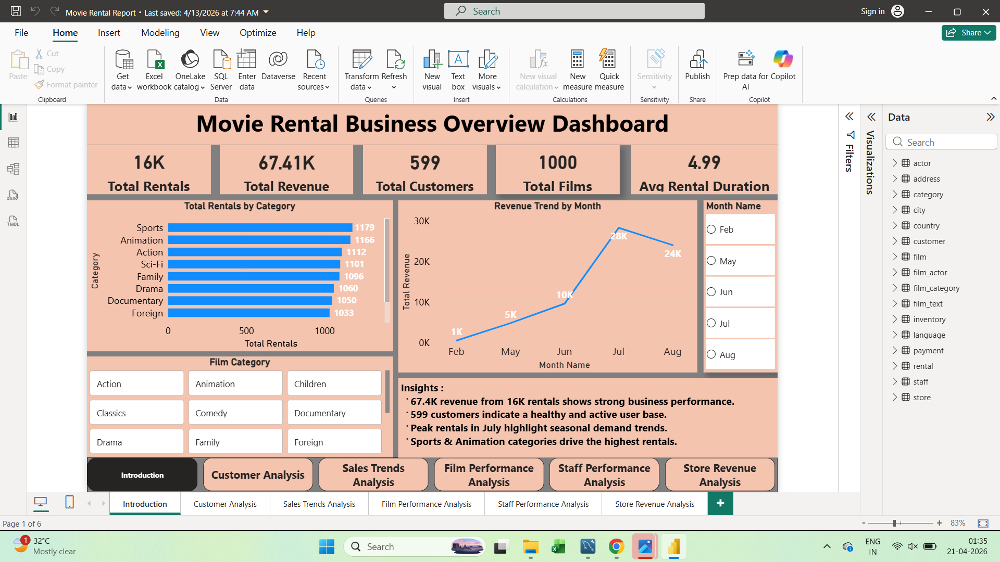
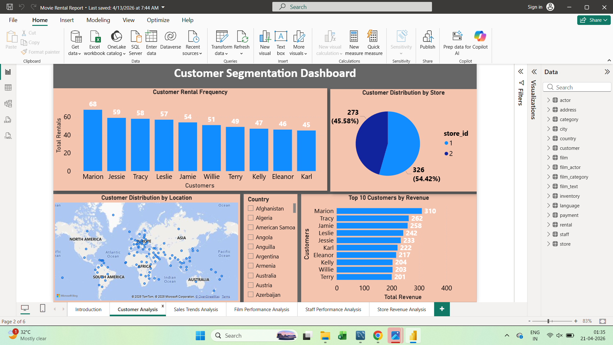

# 🎬 Movie Rental Analysis (Power BI Project)

## 📌 Project Overview
This project analyzes the **Movie Rental Business** using the **Sakila dataset**.  
It focuses on extracting actionable insights related to **customer behavior, revenue trends, and film performance** using Power BI.

---

## 📂 Dataset
The dataset used is the **Sakila Database**, a sample database that simulates a DVD rental store.

It includes:
- Customer information  
- Rental transactions  
- Payment data  
- Film details & categories  
- Store-level data  

---

## 🎯 Objectives
- Analyze rental and revenue patterns  
- Identify top-performing film categories  
- Understand customer engagement  
- Track monthly revenue trends  
- Generate business insights for decision-making  

---

## 🛠️ Tools & Technologies
- Power BI (Dashboard & Visualization)  
- SQL (Data extraction & transformation)  
- Excel (EDA & preprocessing)  
- Sakila Database  

---

## 📊 Key Insights
- 📈 Total Rentals: **16K+**  
- 💰 Total Revenue: **67K+**  
- 👥 Total Customers: **599**  
- 🎬 Total Films: **1000**  
- ⭐ Sports & Animation categories have highest rentals  
- 📅 Peak revenue observed in **July**  

---

## 📁 Project Files
- `movie_rental_dashboard.pbix` → Power BI dashboard  
- `movie_rental_powerbi_report.pbix` → Detailed report  
- `movie_rental_eda_analysis.xlsx` → Data analysis  
- `movie_rental_mece_framework.pdf` → Business framework  
- `movie_rental_presentation.pptx` → Final presentation  

---

## 📸 Dashboard Preview

---

## 🚀 Skills Demonstrated
- Data Cleaning & Transformation  
- Data Visualization (Power BI)  
- Business Analysis  
- Dashboard Design  
- SQL Querying  

---

## 💡 Conclusion
This project demonstrates how data analysis and visualization can help businesses:
- Understand customer behavior  
- Identify revenue drivers  
- Make data-driven decisions  

---

## 👩‍💻 Author
**Shreya Dolas**
